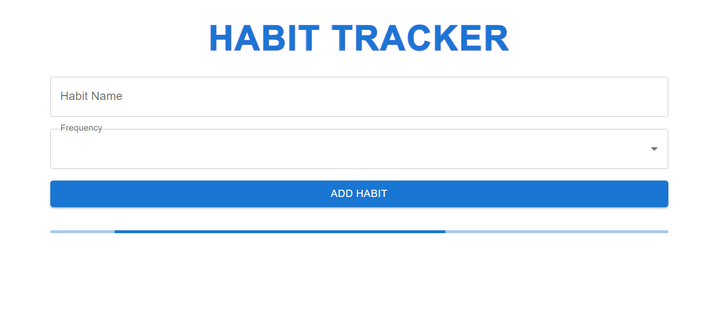
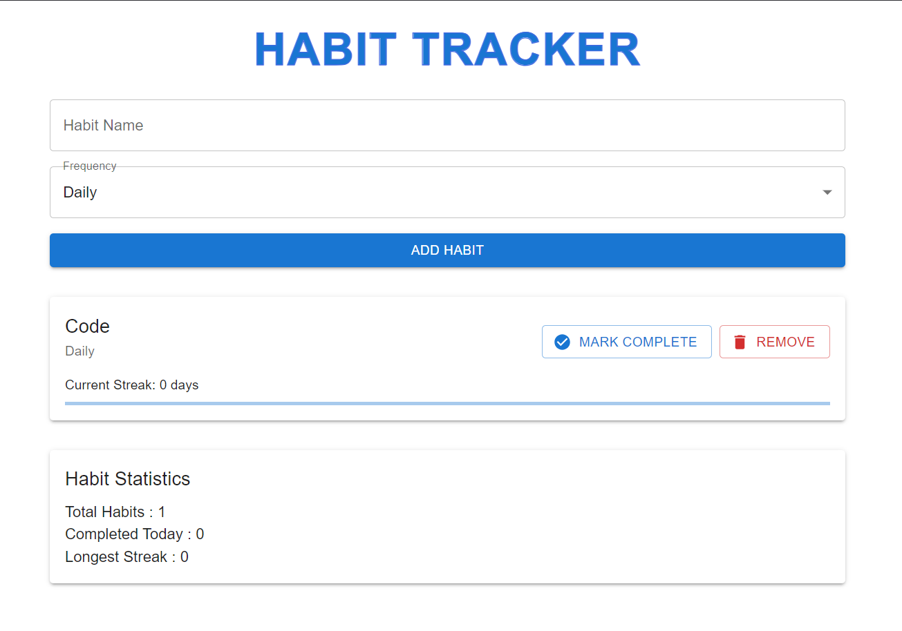
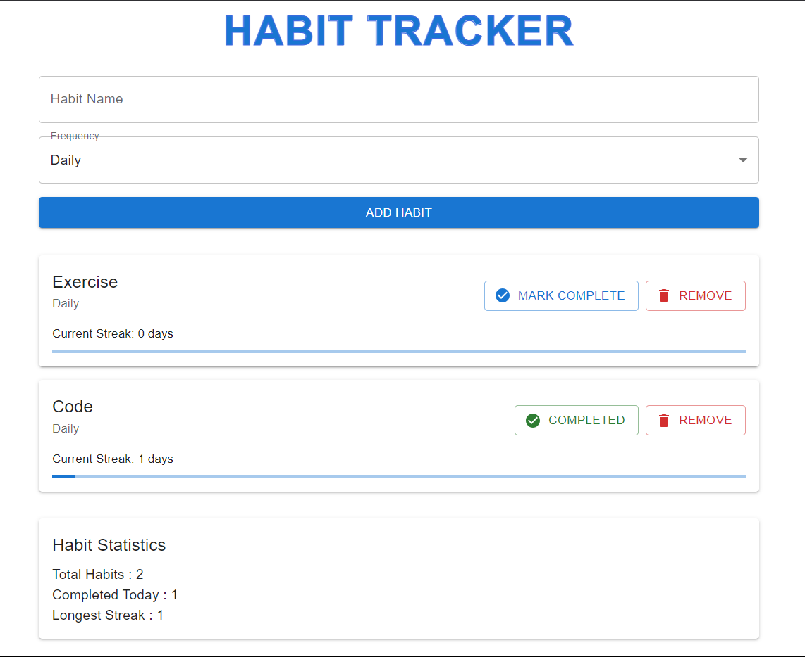

# Habit Tracker

## Introduction

**Habit Tracker** is a web application built with **React**, **Redux**, and **Material-UI**. The app helps users track their habits, mark them as completed, and view statistics like the longest streak and completed habits.

---

## Features

- **Add Habits**: Users can add new habits with daily or weekly frequencies.
- **Mark Habits as Completed**: Habits can be marked as completed for the day.
- **Habit Statistics**: View statistics like total habits, habits completed today, and longest streak.
- **Habit List**: Display all habits, with the option to remove or toggle their completion status.

---

## Technologies Used

- **React**: For building the UI components.
- **Redux Toolkit**: For managing the application state.
- **Material-UI**: For styling and UI components.
- **TypeScript**: For adding type safety to the application.

---

## Folder Structure

```
/src
  /components
    AddHabitForm.tsx         # Form to add new habits
    HabitList.tsx            # Displays the list of habits
    HabitStats.tsx           # Displays the habit statistics
  /store
    habit-slice.ts           # Redux slice for managing habits
    store.ts                 # Redux store configuration
  App.tsx                    # Main application component
  index.tsx                  # Entry point of the application
  App.css                    # Application-wide styles
```

---

## Installation

1. Clone this repository:
   ```bash
   git clone https://github.com/yourusername/habit-tracker.git
   ```

2. Navigate to the project directory:
   ```bash
   cd habit-tracker
   ```

3. Install dependencies:
   ```bash
   npm install
   ```

4. Run the application:
   ```bash
   npm start
   ```

---

## Screenshots

### 1. Add Habit Form



### 2. Habit List



### 3. Habit Statistics



---

## Live Preview

You can view the live demo of the app on Vercel here:

[Live Demo on Vercel](habbit-tracker-beta.vercel.app)

---

## Redux Code (For Easy Reference)

### 1. **`store.ts`** (Redux Store Configuration)

```ts
import { configureStore } from "@reduxjs/toolkit";
import habitsReducer from "./habbit-slice";

const store = configureStore({
  reducer: {
    habits: habitsReducer,
  },
});

export type RootState = ReturnType<typeof store.getState>;
export type AppDispatch = typeof store.dispatch;
export default store;
```

### 2. **`habbit-slice.ts`** (Redux Slice for Habits)

```ts
import { createAsyncThunk, createSlice, PayloadAction } from "@reduxjs/toolkit";

export interface Habit {
  id: string;
  name: string;
  frequency: "daily" | "weekly";
  completedDates: string[];
  createdAt: string;
}

interface HabitState {
  habits: Habit[];
  isLoading: boolean;
  error: string | null;
}

const initialState: HabitState = {
  habits: [],
  isLoading: false,
  error: null,
}

export const fetchHabits = createAsyncThunk("habits/fetchHabits", async () => {
  // Simulating an API call
  await new Promise((resolve) => setTimeout(resolve, 1000));

  const mockHabits: Habit[] = [
    {
      id: "1",
      name: "Read",
      frequency: "daily",
      completedDates: [],
      createdAt: new Date().toISOString(),
    },
    {
      id: "2",
      name: "Exercise",
      frequency: "daily",
      completedDates: [],
      createdAt: new Date().toISOString(),
    },
  ];

  return mockHabits;
});

const habitSlice = createSlice({
  name: "habits",
  initialState,
  reducers: {
    addHabit: (state, action: PayloadAction<{ name: string, frequency: "daily" | "weekly" }>) => {
      const newHabit: Habit = {
        id: Date.now().toString(),
        name: action.payload.name,
        frequency: action.payload.frequency,
        completedDates: [],
        createdAt: new Date().toISOString(),
      };

      state.habits.push(newHabit);
    },

    toggleHabit: (state, action: PayloadAction<{ id: string; date: string }>) => {
      const habit = state.habits.find((h) => h.id === action.payload.id);

      if (habit) {
        const index = habit.completedDates.indexOf(action.payload.date);

        if (index > -1) {
          habit.completedDates.splice(index, 1);
        } else {
          habit.completedDates.push(action.payload.date);
        }
      }
    },

    deleteHabit: (state, action: PayloadAction<{ id: string }>) => {
      const habit = state.habits.find((h) => h.id === action.payload.id);

      if (habit) {
        state.habits = state.habits.filter((h) => h.id !== action.payload.id);
      }
    },
  },
  extraReducers: (builder) => {
    builder.addCase(fetchHabits.pending, (state) => {
      state.isLoading = true;
    })
    .addCase(fetchHabits.fulfilled, (state, action) => {
        state.isLoading = false;
        state.habits = action.payload;
    })
    .addCase(fetchHabits.rejected, (state, action) => {
        state.isLoading = false;
        state.error = action.error.message || "Failed to fetch habits";
    });
  },
});

export const { addHabit, toggleHabit, deleteHabit } = habitSlice.actions;
export default habitSlice.reducer;
```

---

## Acknowledgments

- [React](https://reactjs.org/) - A JavaScript library for building user interfaces.
- [Redux Toolkit](https://redux-toolkit.js.org/) - The official, recommended way to write Redux logic.
- [Material-UI](https://mui.com/) - A popular React UI framework for building responsive designs.

---